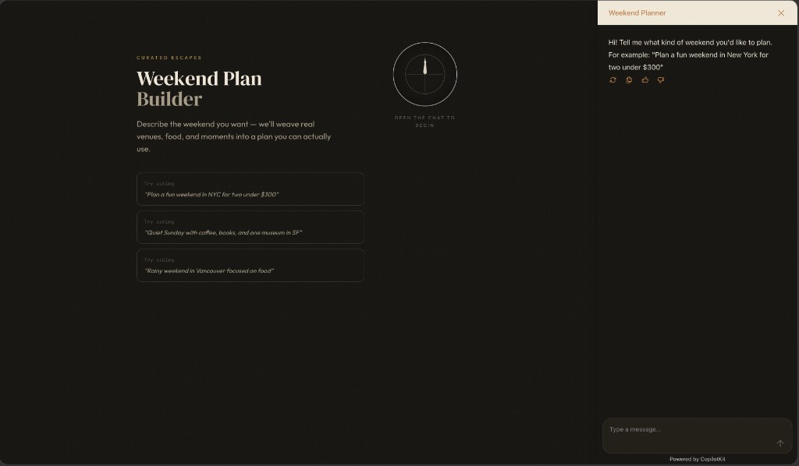
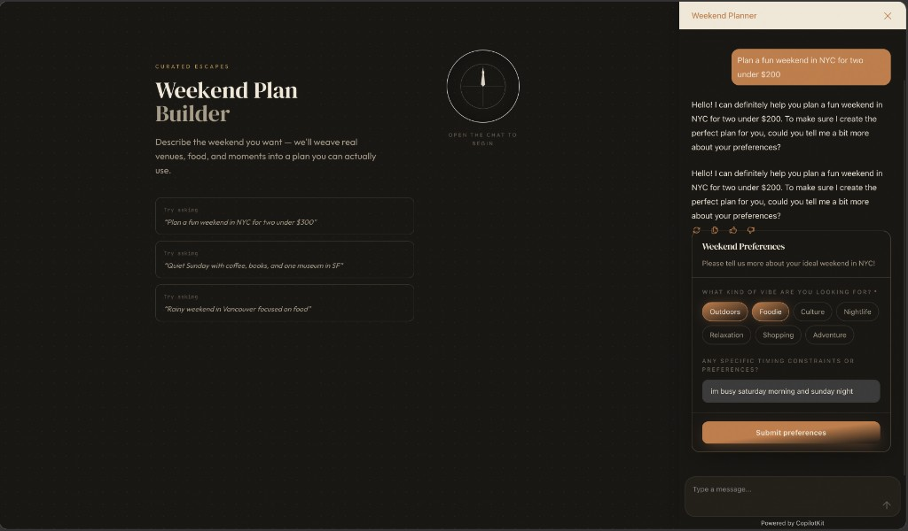

# Weekend Plan Builder

A full-stack agentic web application that helps users plan personalized weekends. The app uses a conversational AI agent to gather preferences, search for real venues and activities, and produce a structured weekend plan rendered as polished UI.

  

## What this is

Instead of typing long answers or juggling browser tabs, you describe the weekend you want in chat. The assistant figures out what it still needs and surfaces **interactive forms** inside the chat (budget, interests, dietary notes, how you are getting there, and so on)—only for details you have not already given. Once preferences are clear, it **searches the live web** for real places and events, then builds a **day-by-day itinerary** shown in a dedicated panel: timed activities, categories, **estimated activity costs plus travel costs** (local transit and main-trip transport when relevant), and source links—not a wall of unstructured text.

## Tech stack

| Layer | Technologies |
|-------|----------------|
| **Backend** | Python 3.11+, [Agno](https://github.com/agno-agi/agno) (`Agent`, `AgentOS`), AG-UI server (`ag-ui-protocol`), FastAPI / Uvicorn, Google **Gemini 2.5 Flash**, [ddgs](https://github.com/deedy5/ddgs) (DuckDuckGo web search) |
| **Frontend** | Next.js 15 (App Router), React 19, TypeScript, Tailwind CSS, CopilotKit (`@copilotkit/react-core`, `@copilotkit/react-ui`, `@copilotkit/runtime`) |
| **AG-UI client** | [`@ag-ui/client`](https://www.npmjs.com/package/@ag-ui/client) `HttpAgent` in [frontend/src/app/api/copilotkit/route.ts](frontend/src/app/api/copilotkit/route.ts) — forwards chat to the backend `POST /agui` endpoint |
| **Types** | Shared TypeScript interfaces in [frontend/src/types/index.ts](frontend/src/types/index.ts) |

CopilotKit provides the chat UI, streaming, and tool-call lifecycle hooks. The **AG-UI protocol** connects that runtime to the Agno backend: the Next.js route wraps `CopilotRuntime` with an `HttpAgent` pointed at your FastAPI server.

## Repository layout

```text
Weekend-Plan-Builder/
├── README.md
├── docs/
│   └── demo/                    # README screenshots + walkthrough video
├── backend/
│   ├── main.py                   # local dev server (uvicorn entry)
│   ├── index.py                  # ASGI re-export of `app` (e.g. serverless)
│   ├── pyproject.toml
│   ├── .env.example
│   └── src/
│       ├── agent.py              # weekend_agent, system prompt, tools list
│       └── tools/
│           ├── backend.py        # web_search (DuckDuckGo)
│           └── frontend.py       # collect_preferences, set_weekend_plan (external_execution)
└── frontend/
    ├── package.json
    ├── .env.example
    └── src/
        ├── app/
        │   ├── layout.tsx        # CopilotKit provider, runtimeUrl
        │   ├── page.tsx          # CopilotSidebar, useCopilotAction hooks
        │   ├── globals.css
        │   └── api/copilotkit/route.ts   # HttpAgent → backend /agui
        ├── components/
        │   ├── PreferencesForm.tsx
        │   └── WeekendPlanView.tsx
        └── types/index.ts
```

## Architecture

**Frontend.** The app is a Next.js client with **CopilotKit** for the chat sidebar, streaming, and tool lifecycle. The [API route](frontend/src/app/api/copilotkit/route.ts) runs **CopilotRuntime** with **`HttpAgent`** from `@ag-ui/client`, which sends AG-UI traffic to the backend. The main area shows either the landing content or **WeekendPlanView** once a plan exists; **PreferencesForm** appears inside the chat when the agent calls `collect_preferences`.

**Backend.** **AgentOS** exposes a FastAPI app (default port 8000) with **`POST /agui`**. The **weekend_agent** uses Gemini 2.5 Flash and three tools: `collect_preferences` and `set_weekend_plan` are marked for execution on the frontend; **`web_search`** runs on the server (DuckDuckGo via `ddgs`).

**Request path:** browser → `POST /api/copilotkit` → `HttpAgent` → `POST /agui` → agent → tools → streamed reply and/or UI updates.

## Setup

### Prerequisites

- Python 3.11+
- Node.js 18+
- A Google API key (Gemini)

### Backend

```bash
cd backend

python -m venv .venv
source .venv/bin/activate   # Windows: .venv\Scripts\activate

pip install -e .

python main.py
```

The API serves at `http://localhost:8000`. The AG-UI endpoint is **`POST /agui`**.

### Frontend

```bash
cd frontend
npm install
npm run dev
```

The app runs at `http://localhost:3000`.

## Environment variables

Copy `backend/.env.example` → `backend/.env` and `frontend/.env.example` → `frontend/.env.local` as needed.

| Variable | Where | Purpose |
|----------|--------|---------|
| `GOOGLE_API_KEY` | `backend/.env` | Gemini API access for the Agno agent |
| `BACKEND_URL` | `frontend/.env.local` | Base URL of the Agno server (default: `http://localhost:8000` if unset) |

## Tool schema design

At least **two** tools reflect deliberate custom schema design; `web_search` is a small wrapper around DuckDuckGo.

### 1. `collect_preferences` (frontend-executed)

The main generative UI surface. The tool uses a flexible `fields` array so the agent chooses **at runtime** what to ask, given what the user already said (e.g. skip city if they named it).

**Schema:**

```python
collect_preferences(
    title: str,
    description: str,
    fields: list[dict],
)
```

Field types: **`select`**, **`multi_select`**, **`text`** — rendered as pills or text input; the frontend returns a JSON object of id → value(s).

### 2. `web_search` (backend-executed)

```python
web_search(
    query: str,
    max_results: int = 5,
)
```

Returns titles, URLs, and snippets; those URLs can flow into plan items as `source_url`.

### 3. `set_weekend_plan` (frontend-executed)

```python
set_weekend_plan(
    title: str,
    city: str,
    summary: str,
    budget_note: str,
    days: list[dict],
)
```

The agent is instructed to treat **`budget_note` as a full picture of estimated spend**, including **travel**: local rides or transit between stops, parking, and (when the user is not already local) rough outbound/return transport, alongside food and activities. Figures are explicitly estimates.

Each day has a theme and timed activities with category (`food` | `activity` | `rest` | `travel`), optional location, note, **`estimated_cost`**, and source URL. Use **`travel`** for between-venue legs and main-trip transport rows so costs can appear on the timeline as well as in `budget_note`.

## How the frontend maps tool schemas to UI (AG-UI behavior)

- **Streaming** — Assistant tokens stream through CopilotKit; the agent is configured with `markdown=True`.
- **Tool lifecycle** — CopilotKit surfaces tool calls, merges streamed arguments, and invokes your hooks when complete.
- **`collect_preferences`** — `renderAndWaitForResponse` in [frontend/src/app/page.tsx](frontend/src/app/page.tsx): [PreferencesForm](frontend/src/components/PreferencesForm.tsx) renders from structured `fields`; on submit, `respond(JSON.stringify(values))` returns the payload to the agent.
- **`set_weekend_plan`** — `handler` stores the plan in React state; `render` shows building/complete states; [WeekendPlanView](frontend/src/components/WeekendPlanView.tsx) shows the plan in the main area.
- **`web_search`** — `available: "remote"` runs on the backend; local `render` only shows progress/complete in chat.

## End-to-end flow

1. User sends a natural-language planning request.
2. Assistant streams text and calls `collect_preferences` with contextual `fields`.
3. Frontend renders the interactive form in the chat.
4. User submits preferences; the tool result is returned to the agent.
5. Agent calls `web_search` (possibly multiple times).
6. Search progress appears in the chat.
7. Agent calls `set_weekend_plan` with a structured itinerary.
8. The main panel shows the weekend plan (days, times, activity and travel cost estimates, links).
9. Assistant may follow up in chat (e.g. adjustments).

## Demo

Static assets live in [docs/demo](docs/demo/). The walkthrough is an H.264 MP4 (scaled to 1280px wide) so it stays small enough for GitHub; the source recording was higher resolution.

**Screenshots**

Landing hero with the CopilotKit sidebar and opening prompt:



Interactive **preferences** form rendered inside the chat (multi-select chips and free-text timing):



**Video**

[docs/demo/demo-walkthrough.mp4](docs/demo/demo-walkthrough.mp4) — full ~2.5 minute screen recording of the flow (chat → preferences → plan).

## Trade-offs, risks, and future work

**Current trade-offs**

- **CopilotKit v1 API** — `useCopilotAction` with `Parameter[]` instead of newer Zod-based helpers due to Next.js 15 barrel compatibility; stable for this app.
- **DuckDuckGo via `ddgs`** — No API key, but rate limits, blocking, or noisy results are possible; weaker than a paid search API.
- **Single model** — All reasoning and synthesis use Gemini 2.5 Flash; a production stack might route cheaper tasks to smaller models.
- **Synchronous search in the agent loop** — Adds latency under load; no queue or cache layer.
- **No persistence** — Conversation and plan live in memory on the client; refresh loses state unless you add storage.

**Operational risks (from real-world use)**

- Search failures can interrupt the flow; retry logic is minimal today.
- No database or auth — fine for a local demo, but required for a production product.

**What we would improve with more time**

- Plan editing and re-planning without restarting the thread
- Persist threads and saved plans
- Map integration (travel times, geography)
- Date-aware planning and weather
- More field types (date, slider, rating)
- Search retries and clearer error recovery
- Stronger skeletons for the plan while streaming
- Optional: commercial search API for reliability

## Assumptions

- **Gemini** is available with a valid `GOOGLE_API_KEY`; model id is `gemini-2.5-flash` in [backend/src/agent.py](backend/src/agent.py).
- **AG-UI** compatibility is provided by Agno’s `AGUI` interface and CopilotKit’s runtime with `HttpAgent` to `POST /agui`.
- **Markdown** in assistant messages is handled by CopilotKit’s chat UI consistent with the agent’s `markdown=True` setting.
- **Tool names and parameters** match between Python tools and `useCopilotAction` definitions so the frontend and backend stay in sync.

If anything in your environment differs (e.g. custom port or proxy), set `BACKEND_URL` and run the backend before the frontend.
